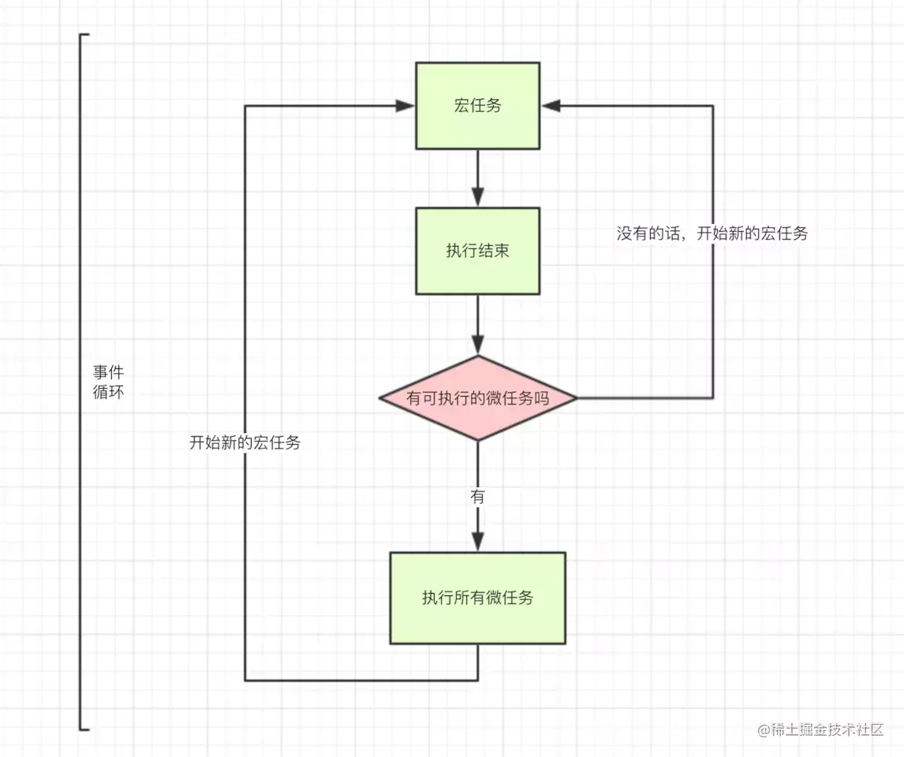

# javasciprt 事件循环

> 多线程任务切换
>
> 

* **javascript 为什么设计为单线程**
  	**js为了保证程序执行的一致性（操作dom问题 =>  一个线程操作dom，一个线程删除dom则会出问题）**
  
* **js是非阻塞性的：**
  
  * **当碰到异步任务时候会用到事件队列去挂起，继续执行栈其他代码**
  * **js会先执行栈里的同步代码，异步代码的执行异步 [返回的结果的回调]() （注册回调函数）放入事件队列挂起，当同步代码执行完毕以后（主线程闲置以后），会进入到事件队列中去查找原本异步代码的回调，又放入执行栈里，开始执行同步代码，异步代码的执行异步 [返回的结果的回调]() （注册回调函数）放入事件队列挂起....**
    
    * **异步代码放入的事件队列会分为微任务，宏任务**
      
      * **先微后宏**
      * **上下文执行，异步代码都挂入到宏任务队列/微任务队列，执行同步代码 =》 执行微任务 =》 执行宏任务**
      
    * **怎么区分宏任务与微任务**
      
    * 以下事件属于宏任务：
      
      - `setInterval()`
      - `setTimeout()`
      
      以下事件属于微任务
      
      - `new Promise()`
      - `new MutaionObserver()`
      
      
      
      * 微任务：microtask queue ：唯一，整个事件循环当中，仅存在一个；执行为同步，同一个事件循环中的microtask会按队列顺序，串行执行完毕；
      
        宏任务：macrotask queue：不唯一，存在一定的优先级（用户I/O部分优先级更高）；异步执行，同一事件循环中，只执行一个。

```javascript
在挂起任务时，JS 引擎会将所有任务按照类别分到这两个队列中，首先在 macrotask宏任务 的队列（这个队列也被叫做 task queue）中取出第一个任务，执行完毕后取出 microtask微任务 队列中的所有任务顺序执行；之后再取 macrotask 宏任务，周而复始，直至两个队列的任务都取完。


JavaScript 为什么要区分微任务和宏任务
区分微任务和宏任务是为了将异步队列任务划分优先级，通俗的理解就是为了插队。

一个 Event Loop，Microtask 是在 Macrotask 之后调用，Microtask 会在下一个 Event Loop 之前执行调用完，并且其中会将 Microtask 执行当中新注册的 Microtask 一并调用执行完，然后才开始下一次 Event Loop，所以如果有新的 Macrotask 就需要一直等待，等到上一个 Event Loop 当中 Microtask 被清空为止。由此可见，我们可以在下一次 Event Loop 之前进行插队。

如果不区分 Microtask 和 Macrotask，那就无法在下一次 Event Loop 之前进行插队，其中新注册的任务得等到下一个 Macrotask 完成之后才能进行，这中间可能你需要的状态就无法在下一个 Macrotask 中得到同步。
```


# 总结





摘自：https://juejin.cn/post/6844903638238756878


```javascript
    step1：主线程读取JS代码，此时为同步环境，形成相应的堆和执行栈；

    step2: 主线程遇到异步任务，指给对应的异步进程进行处理（WEB API）;

    step3: 异步进程处理完毕（Ajax返回、DOM事件处罚、Timer到等），将相应的异步任务推入任务队列；

    step4：主线程查询任务队列，执行"microtask queue"，将其按序执行，全部执行完毕；

    step5：主线程查询任务队列，执行"macrotask queue"，取队首任务执行，执行完毕；

    step6：重复step4、step5。

    "microtask queue"中的所有"callback"处在同一个事件循环中，而"macrotask queue"中的"callback"有自己的事件循环。

    简而言之：同步环境执行 -> 事件循环1（"microtask queue的All"）-> 事件循环2"(macrotask queue中的一个") -> 事件循环1（"microtask queue的All"）-> 事件循环2("macrotask queue中的一个")...

    利用"microtask queue"可以形成一个同步执行的环境，但如果"Microtask queue"太长，将导致"Macrotask"任务长时间执行不了，最终导致用户I/O无响应等，所以使用需慎重。


宏任务按顺序执行，且浏览器在每个宏任务之间渲染页面
所有微任务也按顺序执行，且在以下场景会立即执行所有微任务
    每个回调之后且js执行栈中为空。
    每个宏任务结束后。
```

